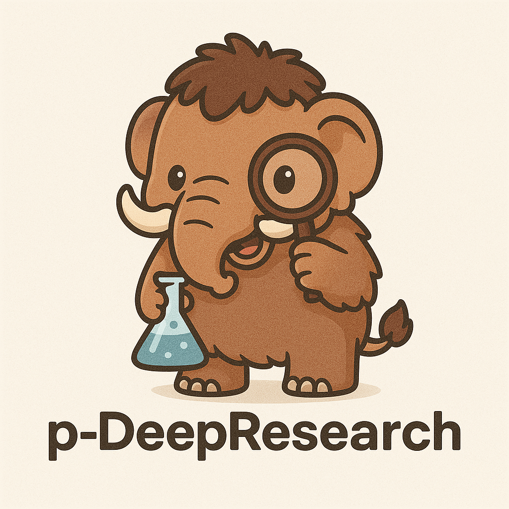
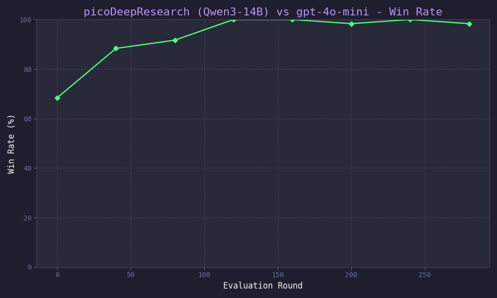
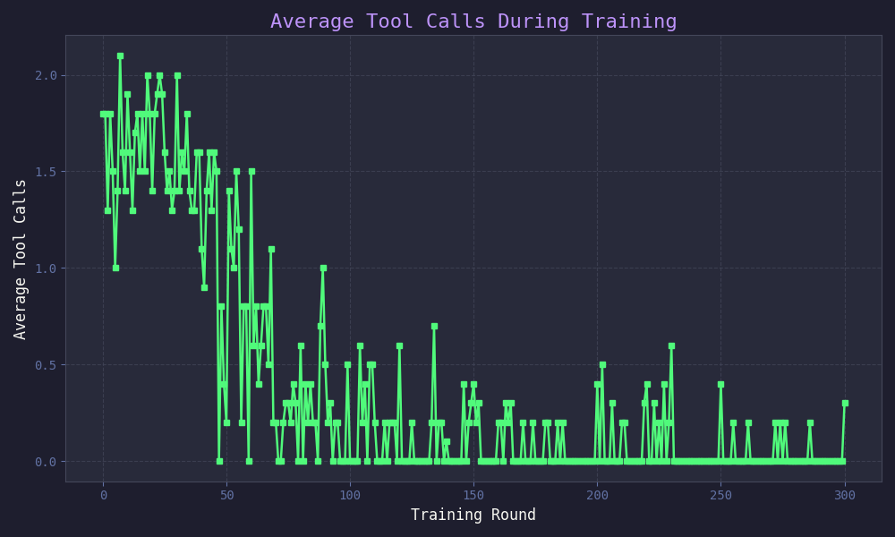

# picoDeepResearch

<p align="center">
  
</p>

## Overview: A pico Recreation of OpenAI's Deep Research

`picoDeepResearch` is a framework for training LLMs to iteratively use tools and synthesize information into research reports, inspired by OpenAI's Deep Research. It integrates several key concepts: principled/rubric-based LLM judging, self-play, multi-turn tool use, and GRPO.

Specifically, given a set of research questions, a suite of tools (initially, basic web search), and a list of principles for evaluation, the training process goes as follows: The LLM generates multiple research reports on the same subject, incorporating tool use in its reasoning and synthesizing the findings into a final report. Then, these reports are judged in a round-robin tournament (or "battle royale" in the "arena") according to the provided principles. The GRPO reward signal is comes from the final tournament rankings, which, when propagated to the model, improve its ability to produce quality Deep Research reports, thereby reinforcing the specific patterns of tool use employed by the model.

The goal is for `picoDeepResearch` to serve as an open-source, small-scale ("pico") method for training custom models to generate reports, and also as a fun environment for experimenting with multi-turn tooling for tasks with "soft" (non-verifiable) rewards.

## The Approach: Tool Use and Reinforcement Learning

The current paradigm in LLMs is shifting to  multi-turn tool use, trained via RL -  where models use tools to gather information and achieve goals. `picoDeepResearch` explores this by enabling an LLM to:

1.  **Iteratively Call Tools**: Starting with web search, the model can make multiple calls to gather information.
2.  **Synthesize Findings**: The information retrieved is used to compile a research report.
3.  **Learn from Feedback**: Reports are evaluated against each other in a round-robin tournament. An LLM judge, guided by a user-defined rubric, provides a reward signal. This signal is then used with GRPO to refine the agent's report-writing and tool-use strategy.

Our aim is to provide a transparent and adaptable framework for exploring how LLMs can become powerful research assistants.

## Motivation: From GRPO Curious to Deep Research Architect

Like many people, I've been very interested in the potential of GRPO for training LLMs. I started with experiments in frameworks like [DeepSeekRL-Extended](https://github.com/brendanhogan/DeepSeekRL-Extended), where I explored everything from standard math datasets to the more creative tasks of AI-generated debates and comedy, and into multi-modal tasks. While these were more explorations than breakthroughs, a particularly compelling idea emerged: the "battle royale" or round-robin tournament for judging.

Consider AI debates: instead of one LLM judge trying to rank, say, 16 debates simultaneously (noisy), what if every possible pair of debates went head-to-head? This pairwise comparison, especially when augmented by an LLM judge using an on-the-fly, generatively created rubric (a technique I've explored with DeepSeek's reward models), proved surprisingly effective.

This underscored a core belief: if you can articulate what "better" means, be it through hard facts or a nuanced rubric, and you have an LLM capable of making reliable pairwise judgments, GRPO can deliver remarkable results. It just works™. That led me to a more ambitious goal: building something akin to OpenAI's Deep Research. It's an incredibly useful application that perfectly marries sophisticated tool use with the kind of "soft," generative rewards GRPO excels at. `picoDeepResearch` is the first step in building towards that vision.

## Repository Structure and Workflow

`picoDeepResearch` operates through a structured workflow:

1.  **`ArenaStage` Configuration**: The user defines an `ArenaStage`. This configuration specifies:
    *   A set of **questions** or research topics.
    *   **Judging principles** (e.g., "Clarity," "Depth," "Use of Evidence").
    *   The relative **weight** of each principle.

2.  **The `Arena`**: This configuration is loaded into an `Arena`, which manages the interaction:
    *   The **training model** generates multiple research reports for a given question, using available tools (initially, Brave Search, limited to three results per query).
    *   Reports undergo a **round-robin tournament**: each report is compared against every other report for that question.
    *   An **LLM judge** (e.g., GPT-4o-mini) evaluates each pair based on the defined principles, determining a winner or tie.
    *   These judgments are aggregated into a **reward signal**.

3.  **Reinforcement Learning (GRPO)**: The reward signal fine-tunes the training model.

The goal is a model that learns to effectively use tools and produce high-quality research reports.

## Installation and Usage

### 1. Setup

a.  **Clone the Repository:**


    git clone https://github.com/brendanhogan/picoDeepResearch.git
    cd picoDeepResearch


b.  **Python Environment & Dependencies:**
    Python 3.10+ is recommended.

    # Create and activate a virtual environment
    python -m venv .venv
    source .venv/bin/activate  # Windows: .\.venv\Scripts\activate

    # Install dependencies
    pip install -r requirements.txt


c.  **API Keys:**
    For API-based models (judge, comparison) or tools (Brave Search), set the following environment variables:


    export OPENAI_API_KEY="your_openai_key"
    export BRAVE_API_KEY="your_brave_search_key"

### 2. Running the Code

The primary script for training and evaluation is `main.py`. It uses `argparse` for configuration.

a.  **View Available Arguments:**

    python main.py --help

    This will list all configurable parameters, including model names, arena settings, hyperparameters, etc.

b.  **Example Training Run:**

    python main.py \
        --model_name "Qwen/Qwen1.5-14B-Chat" \
        --judge_model_name "gpt-4o-mini" \
        --compare_model_name "gpt-4o-mini" \
        --arena_name "debate" \
        --tool_registry "websearch" \
        --output_dir "./output/qwen14b_debate_run1" \
        --num_train_iters 1000 \
        --learning_rate 5e-6 \
        --num_chains 6 \
        --gradient_accumulation_steps 4 \
        --save_steps 50 \
        --eval_iterations 100

    Adjust parameters as needed for your specific setup and goals.

c.  **Configuration Files & Defining New Domains (`ArenaStage`):**
    To train on a new domain or set of questions, you'll define a new `ArenaStage`. This involves specifying the research questions, judging principles, and their weights. The system is designed to handle this primarily through Python configurations within `arenastages.py`. You can add new `ArenaStage` configurations there directly, modeling them after existing examples like the 'debate' stage. Once defined, you can select your new stage using the `--arena_name` argument in `main.py`. The training loop will then automatically use your new set of questions and judging criteria.

    For example, to add a 'medical_research' arena stage, you would:
    1. Edit `arenastages.py`.
    2. Define a new class or dictionary for `medical_research` specifying its unique questions and judging principles/weights.
    3. Register this new stage so it's accessible by `main.py`.
    4. Run training with `--arena_name medical_research`.

    (While external YAML/JSON files could be used for extremely large or dynamic configurations, the current primary method is by extending `arenastages.py`.)

### 3. Outputs and Plotting

All outputs (logs, metrics, checkpoints, reports) are saved to the directory specified by `--output_dir`.

a.  **Logs:**
    *   Console output provides real-time progress.
    *   Detailed logs are saved in the output directory:
        *   `training_logs/`: Contains metrics per round (`metrics_round_X.json`), aggregated training metrics (`train_metrics_log.json`), and detailed generation logs (`X_generations.txt`).
        *   `eval_logs/`: Contains evaluation results (`eval_results_round_X.json`) and detailed text logs.

b.  **PDF Reports:**
    The system generates PDF reports for:
    *   **Training steps**: Found in `training_logs/`, showing completions, scores, and tool usage for each training question.
    *   **Evaluation runs**: Found in `eval_logs/`, summarizing performance against the test set and compare model.


## Code Structure Overview

*   `main.py`: Main script for training, evaluation, and orchestration.
*   `llms.py`: Loads and configures Hugging Face and API-based models.
*   `utils.py`: Helper functions (seeding, logging, PDF generation, text processing).
*   `tools.py`: Defines and manages agent tools (e.g., web search).
*   `arenas.py`: The `Arena` class; manages interaction flow and tool access.
*   `arenastages.py`: Configurations for `ArenaStage` scenarios (questions, principles, weights).
*   `evaluator.py`: The `GenericEvaluator`; computes rewards based on judging principles.
*   `configs/`: (Recommended) Directory for `ArenaStage` YAML/JSON configuration files.
*   `outputs/`: Default directory for all generated logs, reports, and checkpoints.

## Results (Illustrative)

Initial experiments with a Qwen3-14B model on debate-style report generation show promising learning trends.

**Win Rate vs GPT-4o-Mini (Debate Reports - Qwen3-14B)**



**Tool Usage During Training**



## Future Plans

*   **Enhanced Web Search Tool**: Improve robustness, result diversity, and content extraction.
*   **Longer Generation Sequences**: Support more extensive research and report generation.
*   **Expanded Toolset**: Integrate calculators, code interpreters, database query tools.
*   **Diverse Applications**: Test on more complex scenarios (e.g., scientific or medical research report drafting, with appropriate ethical considerations and human oversight).
*   **Advanced Evaluation**: Explore more nuanced reward signals and interactive judging.

## Citation

If you find `picoDeepResearch` useful in your work, please consider citing it:

```bibtex
@software{YourName_picoDeepResearch_YYYY,
  author       = {Brendan Hogan},
  title        = {picoDeepResearch: A Framework for Training LLM Agents with Tool Use and GRPO},
  month        = {May},
  year         = {2025},
  publisher    = {GitHub},
  version      = {0.1.0},
  howpublished = {\url{https://github.com/brendanhogan/picoDeepResearch}}
}
```
